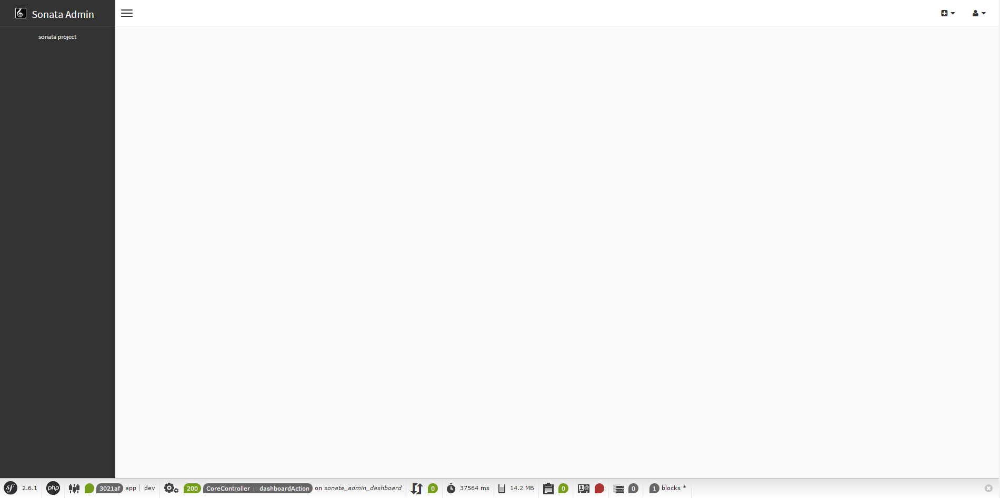

Installation
============

AdminataBundle can be installed at any moment during a project's lifecycle.

Download the Bundle
-------------------

.. code-block:: bash

    composer require idct/adminata:dev-main

``dev-main`` is the only version on Packagist until 1.0 is tagged, and naming it is what lets a
project with ``minimum-stability: stable`` take it.

adminata ``conflict``\ s with the six ``sonata-project/*`` packages it forked — ``admin-bundle``,
``block-bundle``, ``doctrine-extensions``, ``exporter``, ``form-extensions`` and
``twig-extensions`` — because it provides their behaviour under its own names, and blocks, the
Doctrine managers, the exporter, the form types and the Twig helpers are part of the admin bundle
(:doc:`/admin-bundle/reference/block_configuration`,
:doc:`/admin-bundle/reference/exporter_configuration`,
:doc:`/admin-bundle/reference/form_configuration`,
:doc:`/admin-bundle/reference/twig_configuration`). So this one requirement is the whole
install — you do not add ``sonata-project/admin-bundle`` beside it, and Composer will refuse if
you try.

.. note::

    **Migrating an application that already runs Sonata Admin?** Run every Composer command with
    ``--no-plugins --no-scripts``, or Symfony Flex will run the old recipes' ``unconfigure`` and
    delete your ``config/packages/adminata_*.yaml``. See :doc:`/upgrading`.

Download a Storage Bundle
-------------------------

You've now downloaded the AdminataBundle. While this bundle contains all
functionality, it needs storage bundles to be able to communicate with a
database. Before using the AdminataBundle, you have to download one of these
storage bundles. The official storage bundles are:

* `AdminataDoctrineORMBundle`_ (integrates the Doctrine ORM);
* `AdminataDoctrineMongoDBBundle`_ (integrates the Doctrine MongoDB ODM);

Each is a package of its own. The ORM one, ``idct/adminata-doctrine-orm-admin-bundle`` ``^2.0``,
is not on Packagist yet: add a ``vcs`` repository for
``https://github.com/ideaconnect/adminata-doctrine-orm-admin-bundle.git`` before requiring it. The
MongoDB one, ``idct/adminata-admin-mongodb-bundle`` ``^7.0``, is on Packagist and is installed the
usual way.

.. note::

    Don't know which to choose? Most new users prefer AdminataDoctrineORMAdmin,
    to interact with traditional relational databases (MySQL, PostgreSQL, etc).

Enable the Bundle
-----------------

Then, enable the bundle and the bundles it relies on by adding the following
line in ``bundles.php`` file of your project::

    // config/bundles.php

    return [
        // ...
        Symfony\Bundle\SecurityBundle\SecurityBundle::class => ['all' => true],
        Knp\Bundle\MenuBundle\KnpMenuBundle::class => ['all' => true],
        IDCT\Adminata\AdminataBundle::class => ['all' => true],
        Symfony\UX\StimulusBundle\StimulusBundle::class => ['all' => true],
    ];

``AdminataBundle`` is one line, not six: the blocks, the Doctrine managers, the form types,
the Twig helpers and the exporter are part of it, so there is no ``SonataBlockBundle``,
``SonataDoctrineBundle``, ``SonataFormBundle``, ``SonataTwigBundle`` or ``SonataExporterBundle``
to register. What they contribute — the ``adminata_block``, ``adminata_form``, ``adminata_twig`` and
``adminata_exporter`` configuration roots, the ``adminata.block.*``, ``adminata.form.*``,
``adminata.twig.*`` and ``adminata.exporter.*`` services, the Doctrine manager, adapter and mapper
services, and the block and flash-message Twig functions — the admin bundle registers itself. See
:doc:`/admin-bundle/reference/block_configuration`,
:doc:`/admin-bundle/reference/form_configuration`,
:doc:`/admin-bundle/reference/twig_configuration` and
:doc:`/admin-bundle/reference/exporter_configuration`.

Configure the Installed Bundles
-------------------------------

Now all needed bundles are downloaded and registered, you have to add some
configuration. The admin interface uses *blocks* to put everything on the dashboard.
Blocks are part of ``AdminataBundle`` — there is no block bundle to register — and
they have a configuration root of their own, ``adminata_block``. You have to tell it
about the existence of the admin block:

.. code-block:: yaml

    # config/packages/adminata.yaml

    adminata_block:
        blocks:
            # enable the AdminataBundle block
            adminata.admin.block.admin_list:
                contexts: [admin]

.. note::

    Don't worry too much if, at this point, you don't yet understand fully
    what a block is. Blocks are a useful tool, but it's not vital that you
    understand them in order to use the admin bundle.
    :doc:`/admin-bundle/reference/block_configuration` has the whole story.

Enable the "translator" service
-------------------------------

The translator service is required by Adminata to display all labels properly.
For more information: https://symfony.com/doc/5.4/translation.html#configuration

.. code-block:: yaml

    # config/packages/framework.yaml

    framework:
        translator: { fallbacks: ['%locale%'] }

Define routes
-------------

The bundles are now registered and configured correctly. To be able to access AdminataBundle's pages,
the Symfony router needs to know the routes provided by the AdminataBundle.
You can do this by adding its routes to your application's routing file:

.. code-block:: yaml

    # config/routes/adminata.yaml

    admin_area:
        resource: '@AdminataBundle/Resources/config/routing/adminata.xml'
        prefix: /admin

    _adminata_admin:
        resource: .
        type: adminata
        prefix: /admin

.. note::

    If you're using XML or PHP to specify your application's configuration,
    the above routing configuration must be placed in routing.xml or
    routing.php according to your format (i.e. XML or PHP).

.. note::

    For those curious about the ``resource: .`` setting: it is unusual syntax but used
    because Symfony requires a resource to be defined (which points to a real file).
    Once this validation passes Sonata's ``AdminPoolLoader`` is in charge of processing
    this route and it ignores the resource setting.

At this point you can already access the (empty) admin dashboard by visiting the URL:
``http://yoursite.local/admin/dashboard``.

Preparing your Environment
--------------------------

As with all bundles you install, it's a good practice to clear the cache and
install the assets:

.. code-block:: bash

    bin/console cache:clear
    bin/console assets:install public

``assets:install`` matters more here than it does for most bundles: adminata's stylesheet, its
JavaScript bundle and its self-hosted fonts are all shipped as public assets, and without it the
admin renders unstyled. Use ``--symlink --relative`` while developing so a rebuilt asset is picked
up without re-running the command.

.. tip::

    The moment your **own** templates use Tailwind utilities, compile the stylesheet yourself
    rather than shipping adminata's built one — Tailwind only generates a class it can see in a
    scanned source, so a utility that appears nowhere in adminata does not exist in that file. See
    :doc:`/tailwind`.

The Admin Interface
-------------------

You've finished the installation process, congratulations. If you fire up the
server, you can now visit the admin page on http://localhost:8000/admin

.. note::

    This tutorial assumes you are using the build-in server using the
    ``bin/console server:start`` (or ``server:run``) command.

As you can see, the admin panel is very empty. This is because no bundle has
provided admin functionality for the admin bundle yet. Fortunately, you'll
learn how to do this in the :doc:`next chapter <creating_an_admin>`.

.. _`installation chapter`: https://getcomposer.org/doc/00-intro.md
.. _AdminataDoctrineORMBundle: https://github.com/ideaconnect/adminata-doctrine-orm-admin-bundle
.. _AdminataDoctrineMongoDBBundle: https://github.com/ideaconnect/adminata-admin-mongodb-bundle
