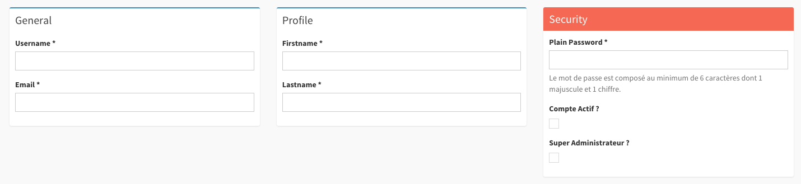

Creating and Editing objects
============================

This document will cover the Create and Edit actions. It will cover configuration
of the fields and forms available in these views and any other relevant settings.

Basic configuration
-------------------

Adminata Options that may affect the create or edit view:

.. code-block:: yaml

    # config/packages/adminata.yaml

    adminata:
        options:
            html5_validate:  true     # enable or disable html5 form validation
            confirm_exit:    true     # enable or disable a confirmation before navigating away
            js_debug:        false    # enable or disable to show javascript debug messages
            use_stickyforms: true     # enable or disable the floating buttons
            form_type:       standard # can also be 'horizontal'

        templates:
            edit:              '@Adminata/CRUD/edit.html.twig'
            tab_menu_template: '@Adminata/Core/tab_menu_template.html.twig'

.. note::

    ``use_select2``, ``use_icheck`` and ``use_bootlint`` are **removed nodes**, and leaving one in
    your configuration is a container build error. adminata ships no select enhancement, no
    checkbox replacement and no Bootstrap linter: every ``<select>``, checkbox and radio is the
    browser's own. See :doc:`/upgrading`.

    The tab menu is one of the templates :doc:`not yet ported </porting-status>`.

Routes
------

You can disable creating or editing entities by removing the corresponding routes in your Admin.
For more detailed information about routes, see :doc:`routing`::

    // src/Admin/PersonAdmin.php

    final class PersonAdmin extends AbstractAdmin
    {
        protected function configureRoutes(RouteCollectionInterface $collection): void
        {
            /* Removing the edit route will disable editing entities. It will also
            use the 'show' view as default link on the identifier columns in the list view. */
            $collection->remove('edit');

            /* Removing the create route will disable creating new entities. It will also
            remove the 'Add new' button in the list view. */
            $collection->remove('create');
        }
    }

Adding form fields
------------------

Within the ``configureFormFields`` method you can define which fields should
be shown when editing or creating entities. Each field has to be added to a
specific form group. And form groups can optionally be added to a tab.
See `FormGroup options`_ for additional information about configuring form
groups::

    // src/Admin/PersonAdmin.php

    final class PersonAdmin extends AbstractAdmin
    {
        protected function configureFormFields(FormMapper $form): void
        {
            $form
                ->tab('General') // The tab call is optional
                    ->with('Addresses')
                        ->add('title') // Add a field and let Sonata decide which type to use
                        ->add('streetname', TextType::class) // Add a textfield
                        ->add('housenumber', NumberType::class) // Add a number field
                        ->add('housenumberAddition', TextType::class, ['required' => false]) // Add a non-required text field
                    ->end() // End form group
                ->end() // End tab
            ;
        }
    }

Using the FormMapper add method, you can add form fields. The add method
has 4 parameters:

- ``name``: The name of your entity.
- ``type``: The type of field to show; by defaults this is ``null`` to let
  Sonata decide which type to use. See :doc:`Field Types <field_types>`
  for more information on available types.
- ``options``: The form options to be used for the field. These may differ
  per type. See :doc:`Field Types <field_types>` for more information on
  available options.
- ``fieldDescriptionOptions``: The field description options. Options here
  are passed through to the field template. See :ref:`Form Types, FieldDescription
  options <form_types_fielddescription_options>` for more information.

.. note::

    The property entered in ``name`` should be available in your Entity
    through getters/setters or public access.

FormGroup options
-----------------

When adding a form group to your edit/create form, you may specify some
options for the group itself.

- ``collapsed``: unused at the moment
- ``class``: The class for your form group in the admin; by default, the
  value is set to ``col-span-12``.
- ``fields``: The fields in your form group (you should NOT override this
  unless you know what you're doing).
- ``class``: the class of the group's wrapper — its grid span, and any hook of your own. A
  group that one field's value should show or hide carries a hook here and the field carries
  ``adminata-reveal``: see :doc:`/javascript`.
- ``box_class``: The class for your form group box in the admin; by default,
  the value is set to ``box box-primary``.
- ``description``: A text shown at the top of the form group.
- ``translation_domain``: The translation domain for the form group title
  (the Admin translation domain is used by default).

To specify options, do as follows::

    // src/Admin/PersonAdmin.php

    final class PersonAdmin extends AbstractAdmin
    {
        protected function configureFormFields(FormMapper $form): void
        {
            $form
                ->tab('General') // the tab call is optional
                    ->with('Addresses', [
                        'class'       => 'col-span-12 md:col-span-8',
                        'box_class'   => 'box box-solid box-danger',
                        'description' => 'Lorem ipsum',
                        // ...
                    ])
                        ->add('title')
                        // ...
                    ->end()
                ->end()
            ;
        }
    }

Here is an example of what you can do with customizing the box_class on
a group:

.. _form_layout_masonry:

Masonry layout
--------------

Every group is a card in a twelve-column grid, and a grid row is as tall as its tallest card:
a short group beside a long one drags a card's height of empty page under it, and a form of
many unequal groups is mostly holes. A tab whose ``layout`` is ``masonry`` renders its groups
as equal-width columns instead, packed by the ``adminata-masonry`` controller — each card goes
under whichever column ended soonest, in declaration order, with nothing moved in the DOM and
nothing positioned absolutely, so focus, listboxes and the controllers inside a card are
untouched. Once placed, a card is pinned to its column: one that grows (a collection row
added, an error shown) pushes the cards under it down rather than reshuffling the form. The
packing is redone when the cards change width — a breakpoint crossed, the sidebar folded.

The tab is the ``default`` one unless the form declares tabs, so it is opened by name::

    $form
        ->tab('default', ['layout' => 'masonry'])
            ->with('Details')
                // ...
            ->end()
            ->with('Pricing')
                // ...
            ->end()
            ->with('Variants', ['class' => 'col-span-full'])
                // ...
            ->end()
        ->end();

Tab options:

- ``layout``: ``grid`` (the default, the twelve-column grid the group ``class`` addresses) or
  ``masonry``.
- ``columns``: the grid's column classes under ``masonry``, by default
  ``grid-cols-1 lg:grid-cols-2 xl:grid-cols-3``.

Under ``masonry`` a group's ``class`` is still emitted on its wrapper, so ``col-span-full``
makes a wide group — a collection rendered as a table — which the same auto-placement puts
under all the columns, and a hook for ``adminata-reveal`` keeps working. Without JavaScript
the tab is an ordinary grid of that many columns, one card per cell. The show page's tabs take
the same two options.

.. _form_tabs:

Tabs
----

A form with more than one ``tab()`` — or one tab not named ``default`` — renders them as tabs:
a row of tab links underlined in the brand colour over one panel at a time, the WAI-ARIA
tabs pattern driven by ``adminata-tabs`` (arrow keys, Home and End move between them). Each
tab lays out its own groups, on the grid or in ``masonry``::

    $form
        ->tab('Device', ['layout' => 'masonry'])
            ->with('Basics')
                // ...
            ->end()
        ->end()
        ->tab('Opening hours')
            ->with('Defaults')
                // ...
            ->end()
        ->end();

The selected tab survives a save: ``adminata-edit`` writes it into the address as ``?_tab=`` and
into the ``_tab`` field the redirect carries, and it is read back by its index — the tab ids
carry the admin's uniqid, which the next request does not. After a submission the server
rejected, the first tab holding a field with an error is brought forward and marked, so the
error is seen; with ``html5_validate`` on, the same happens for the first field the browser
finds invalid, before it tries to focus it. The panels are rendered with their state — the
other tabs' `hidden` — so the page opens on the right tab without a flash of the others; the
script is what makes the other tabs reachable.

Displaying custom data/template
-------------------------------

If you need a specific layout between some fields, you can define a custom template
with the adminata TemplateType::

    namespace App\Admin;

    use IDCT\Adminata\Admin\AbstractAdmin;
    use IDCT\Adminata\Form\FormMapper;
    use IDCT\Adminata\Form\Type\TemplateType;

   final class PersonAdmin extends AbstractAdmin
    {
        protected function configureFormFields(FormMapper $form): void
        {
            $form
                 ->add('title')
                 ->add('googleMap', TemplateType::class, [
                     'template'   => 'path/to/your/template.html.twig'
                     'parameters' => [
                         'url' => $this->generateGoogleMapUrl($this->getSubject()),
                     ],
                 ])
                 ->add('streetname', TextType::class)
                 ->add('housenumber', NumberType::class);
        }
    }

The related template:

.. code-block:: html+twig

    <a href="{{ url }}">{{ object.title }}</a>

Embedding other Admins
----------------------

.. note::

    **TODO**:
    * how to embed one Admin in another (1:1, 1:M, M:M)
    * how to access the right object(s) from the embedded Admin's code
