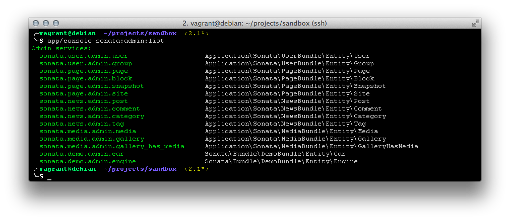
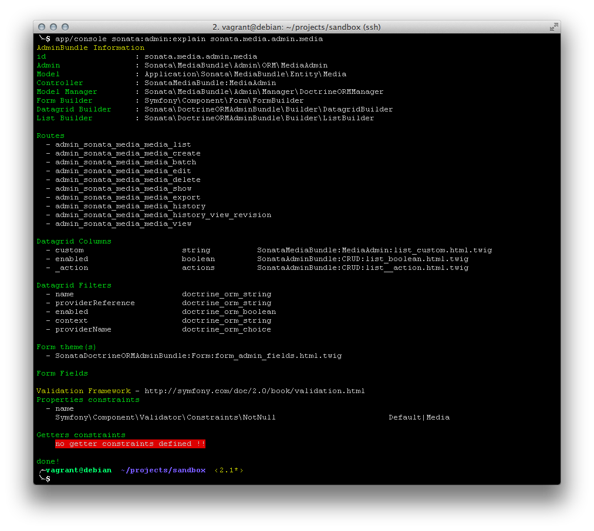

Console/Command-Line Commands
=============================

AdminataBundle provides the following console commands:

* ``cache:create-cache-class``
* ``make:adminata:admin``
* ``adminata:list``
* ``adminata:explain``
* ``adminata:setup-acl``
* ``adminata:generate-object-acl``

cache:create-cache-class
------------------------

The ``cache:create-cache-class`` command generates the cache class
(``var/cache/...env.../classes.php``) from the classes.map file.

.. code-block:: bash

    bin/console cache:create-cache-class

make:adminata:admin
-------------------

The ``make:adminata:admin`` command generates a new Admin class based on the given model
class, registers it as a service and potentially creates a new controller.
As an argument you need to specify the fully qualified model class.
All passed arguments and options are used as default values in interactive mode.
You can disable the interactive mode with ``--no-interaction`` option.

The command require the `Symfony Maker Bundle`_ to work. If you don't already have it, you can install it with :

.. code-block:: bash

    composer require symfony/maker-bundle --dev

===============   ===============================================================================================================================
Options           Description
===============   ===============================================================================================================================
 **model**        The fully qualified model class, e.g. "App\Entity\Foo"
 **admin**        the admin class basename (by default this adds "Admin" to the model class name, e.g. "FooAdmin")
 **controller**   the controller class basename (by default this adds "AdminController" to the model class name, e.g. "FooAdminController")
 **manager**      the model manager type (by default this is the first registered model manager type, e.g. "orm")
 **services**     the services YAML file (the default value is "services.yaml")
 **id**           the admin service ID (the default value is combination of "admin" and admin class basename like "admin.foo_bar")
===============   ===============================================================================================================================

.. code-block:: bash

    bin/console make:adminata:admin App/Entity/Foo

adminata:list
-----------------

To see which admin services are available use the ``adminata:list`` command.
It prints all the admin service ids available in your application. This command
gets the ids from the ``adminata.admin.pool`` service where all the available admin
services are registered.

.. code-block:: bash

    bin/console adminata:list

adminata:explain
--------------------

The ``adminata:explain`` command prints details about the admin of a model.
As an argument you need to specify the admin service id of the Admin to explain.

.. code-block:: bash

    bin/console adminata:explain adminata.news.admin.post

adminata:setup-acl
----------------------

The ``adminata:setup-acl`` command updates ACL definitions for all Admin
classes available in ``adminata.admin.pool``. For instance, every time you create a
new ``Admin`` class, you can create its ACL by using the ``adminata:setup-acl``
command. The ACL database will be automatically updated with the latest masks
and roles.

.. code-block:: bash

    bin/console adminata:setup-acl

adminata:generate-object-acl
--------------------------------

The ``adminata:generate-object-acl`` is an interactive command which helps
you to generate ACL entities for the objects handled by your Admins. See the help
of the command for more information.

.. code-block:: bash

    bin/console adminata:generate-object-acl

.. _`Symfony Maker Bundle`: https://symfony.com/doc/current/bundles/SymfonyMakerBundle/index.html
