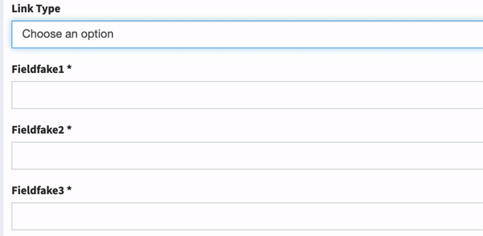
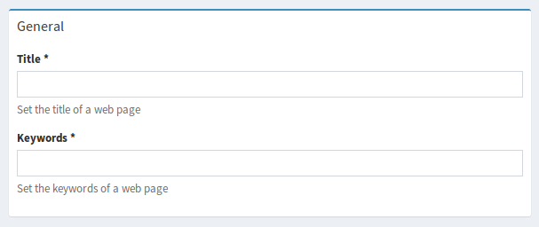

Form Types
==========

.. note::

    **``ModelListType`` is not yet ported.** It drives the association edit flows, which are built
    on AJAX form submission — something adminata does not have and will not add. Use
    ``ModelAutocompleteType``, which was rewritten as an ARIA 1.2 combobox, or ``ModelType`` for a
    native select. See :doc:`/porting-status`.

.. note::

    **Two collection types, and the short name changed hands.**
    ``IDCT\Adminata\Form\Type\CollectionType`` (block prefix ``adminata_type_collection``) is
    the one the storage layer renders as an association collection; it is form-extensions'
    collection type, which carried the short name in its own package.
    ``IDCT\Adminata\Form\Type\NativeCollectionType`` (block prefix
    ``adminata_type_native_collection``) wraps Symfony's own collection type with add and delete
    buttons; it is the admin bundle's own, which carried the short name in *its* package. Both are
    below, and updating an import without reading which is which silently changes the widget that
    renders. The table is in `UPGRADE.md
    <https://github.com/ideaconnect/adminata/blob/main/UPGRADE.md>`_ §6.2.

Admin related form types
------------------------

When defining fields in your admin classes you can use any of the standard
`Symfony field types`_ and configure them as you would normally. In addition
there are some special Sonata field types which allow you to work with
relationships between one entity class and another.

.. _field-types-model:

IDCT\\Adminata\\Form\\Type\\ModelType
^^^^^^^^^^^^^^^^^^^^^^^^^^^^^^^^^^^^^^^^^^

This type allows you to choose an existing
entity from the linked model class. In effect it shows a list of options from
which you can choose a value (or values).

For example, we have an entity class called ``Page`` which has a field called
``image1`` which maps a relationship to another entity class called ``Image``.
All we need to do now is add a reference for this field in our ``PageAdmin`` class::

    // src/Admin/PageAdmin.php

    use IDCT\Adminata\Form\FormMapper;
    use IDCT\Adminata\Admin\AbstractAdmin;
    use IDCT\Adminata\Form\Type\ModelType;

    final class PageAdmin extends AbstractAdmin
    {
        protected function configureFormFields(FormMapper $form): void
        {
            $imageFieldOptions = []; // see available options below

            $form
                ->add('image1', ModelType::class, $imageFieldOptions)
            ;
        }
    }

Note that the third parameter to ``FormMapper::add()`` is optional so
there is no need to pass in an empty array, it is shown here only to demonstrate
where the options go when you want to use them.

Since the ``image1`` field refers to a related entity we do not need to specify
any options. Sonata will calculate that the linked admin class is of type ``Image`` and,
by default, use the ``ImageAdmin`` class to retrieve a list of all existing Images
to display as choices in the selector.

.. tip::

    You need to create ``ImageAdmin`` class in this case to use ``adminata_type_model`` type.
    :ref:`You can also use <form_types_fielddescription_options>` use the ``admin_code`` parameter.

The available options are:

``property``
  defaults to ``null``. You can set this to a `Symfony PropertyPath`_ compatible
  string to designate which field to use for the choice values.

``query``
  defaults to ``null``. You can set this to a ProxyQueryInterface instance in order to
  define a custom query for retrieving the available options.

``template``
  defaults to 'choice' (not currently used?)

``multiple``
  defaults to ``false`` - see the `Symfony choice Field Type docs`_ for more info

``expanded``
  defaults to ``false`` - see the `Symfony choice Field Type docs`_ for more info

``choices``
  defaults to ``null`` - see the `Symfony choice Field Type docs`_ for more info

``preferred_choices``
  defaults to [] - see the `Symfony choice Field Type docs`_ for more info

``choice_loader``
  defaults to a ``ModelChoiceLoader`` built from the other options

``model_manager``
  defaults to ``null``, but is actually calculated from the linked admin class.
  You usually should not need to set this manually.

``class``
  The entity class managed by this field. Defaults to ``null``, but is actually
  calculated from the linked admin class. You usually should not need to set
  this manually.

``btn_add``, ``btn_list``, ``btn_delete`` and ``btn_translation_domain``:
  The labels on the ``add``, ``list`` and ``delete`` buttons can be customized
  with these parameters. Setting any of them to ``false`` will hide the
  corresponding button. You can also specify a custom translation domain
  for these labels, which defaults to ``AdminataBundle``.

.. note::

    An admin class for the linked model class needs to be defined to render this form type.

.. note::

    If you need to use a sortable ``IDCT\Adminata\Form\Type\ModelType`` check the :doc:`../cookbook/recipe_sortable_adminata_type_model` page.

.. note::

    When using ``IDCT\Adminata\Form\Type\ModelType`` with ``btn_add``, a jQuery event will be
    triggered when a child form is added to the DOM
    (``adminata-admin-setup-list-modal`` by default and
    ``adminata-admin-append-form-element`` when using ``edit:inline``).

IDCT\\Adminata\\Form\\Type\\ModelListType
^^^^^^^^^^^^^^^^^^^^^^^^^^^^^^^^^^^^^^^^^^^^^^

This type allows you to choose an existing entity,
add a new one or edit the one that is already selected.

For example, we have an entity class called ``Page`` which has a field called
``image1`` which maps a relationship to another entity class called ``Image``.
All we need to do now is add a reference for this field in our ``PageAdmin`` class::

    // src/Admin/PageAdmin.php

    use IDCT\Adminata\Form\Type\ModelListType;
    use IDCT\Adminata\Form\FormMapper;

    final class PageAdmin extends AbstractAdmin
    {
        protected function configureFormFields(FormMapper $form): void
        {
            $form
                ->add('image1', ModelListType::class)
            ;
        }
    }

The available options are:

``model_manager``
  defaults to ``null``, but is actually calculated from the linked admin class.
  You usually should not need to set this manually.

``class``
  The entity class managed by this field. Defaults to ``null``, but is actually
  calculated from the linked admin class. You usually should not need to set
  this manually.

``btn_add``, ``btn_edit``, ``btn_list``, ``btn_delete`` and ``btn_translation_domain``:
  The labels on the ``add``, ``edit``, ``list`` and ``delete`` buttons can be customized
  with these parameters. Setting any of them to ``false`` will hide the
  corresponding button. You can also specify a custom translation domain
  for these labels, which defaults to ``AdminataBundle``.

.. note::

    For more info, see the storage-engine-specific form field definitions: `ORM`_ or `MongoDB`_

IDCT\\Adminata\\Form\\Type\\ModelHiddenType
^^^^^^^^^^^^^^^^^^^^^^^^^^^^^^^^^^^^^^^^^^^^^^^^
The value of hidden field is identifier of related entity::

    // src/Admin/PageAdmin.php

    use IDCT\Adminata\Form\FormMapper;
    use IDCT\Adminata\Admin\AbstractAdmin;
    use IDCT\Adminata\Form\Type\ModelHiddenType;

    final class PageAdmin extends AbstractAdmin
    {
        protected function configureFormFields(FormMapper $form): void
        {
            // generates hidden form field with id of related Category entity
            $form
                ->add('categoryId', ModelHiddenType::class)
            ;
        }
    }

The available options are:

``model_manager``
  defaults to ``null``, but is actually calculated from the linked admin class.
  You usually should not need to set this manually.

``class``
  The entity class managed by this field. Defaults to ``null``, but is actually
  calculated from the linked admin class. You usually should not need to set
  this manually.

IDCT\\Adminata\\Form\\Type\\ModelAutocompleteType
^^^^^^^^^^^^^^^^^^^^^^^^^^^^^^^^^^^^^^^^^^^^^^^^^^^^^^

This type allows you to choose an existing entity from the linked model class.
In effect it shows a list of options from which you can choose a value.
The list of options is loaded dynamically with ajax after typing 3 chars (autocomplete).
It is best for entities with many items.

This field type works by default if the related entity has an admin instance and
in the related entity datagrid is a string filter on the ``property`` field.

For example, we have an entity class called ``Article`` (in the ``ArticleAdmin``)
which has a field called ``category`` which maps a relationship to another entity
class called ``Category``. All we need to do now is add a reference for this field
in our ``ArticleAdmin`` class and make sure, that in the ``CategoryAdmin`` exists
datagrid filter for the property ``title``::

    // src/Admin/ArticleAdmin.php

    use IDCT\Adminata\Form\FormMapper;
    use IDCT\Adminata\Admin\AbstractAdmin;
    use IDCT\Adminata\Form\Type\ModelAutocompleteType;

    final class ArticleAdmin extends AbstractAdmin
    {
        protected function configureFormFields(FormMapper $form): void
        {
            // the dropdown autocomplete list will show only Category
            // entities that contain specified text in "title" attribute
            $form
                ->add('category', ModelAutocompleteType::class, [
                    'property' => 'title'
                ])
            ;
        }
    }

.. code-block:: php

    // src/Admin/CategoryAdmin.php

    use IDCT\Adminata\Datagrid\DatagridMapper;
    use IDCT\Adminata\Admin\AbstractAdmin;

    final class CategoryAdmin extends AbstractAdmin
    {
        protected function configureDatagridFilters(DatagridMapper $datagrid)
        {
            // this text filter will be used to retrieve autocomplete fields
            $datagrid
                ->add('title')
            ;
        }
    }

The available options are:

``property``
  defaults to ``null``. You have to set this to designate which field (or a list of fields) to use for the choice values.
  This value can be string or array of strings.

``class``
  The entity class managed by this field. Defaults to ``null``, but is actually
  calculated from the linked admin class. You usually should not need to set
  this manually.

``model_manager``
  defaults to ``null``, but is actually calculated from the linked admin class.
  You usually should not need to set this manually.

``callback``
  defaults to ``null``. Callable function that can be used to modify the query which is used to retrieve autocomplete items.
  The callback should receive three parameters - the admin instance, the property (or properties) defined as searchable and the
  search value entered by the user.

  From the ``$admin`` parameter it is possible to get the ``Datagrid`` and the ``Request``::

      $form
          ->add('category', ModelAutocompleteType::class, [
              'property' => 'title',
              'callback' => static function (AdminInterface $admin, string $property, $value): void {
                  $datagrid = $admin->getDatagrid();
                  $query = $datagrid->getQuery();
                  $query
                      ->andWhere($query->getRootAlias() . '.foo=:barValue')
                      ->setParameter('barValue', $admin->getRequest()->get('bar'))
                  ;
                  $datagrid->setValue($property, null, $value);
              },
          ])
      ;

  If you want to dynamically change the ``property`` being filtered on to something else,
  you can use a prefix system, as follows.
  When the user types **id: 20** the property used for filtering is "id".
  When they type **username: awesome_user_name**, it will be "username"::

      $form
          ->add('category', ModelAutocompleteType::class, [
              'property' => 'title',
              'callback' => static function (AdminInterface $admin, string $property, string $value): void {
                  $datagrid = $admin->getDatagrid();

                  $valueParts = explode(':', $value);
                  if (count($valueParts) === 2 && in_array($valueParts[0], ['id', 'email', 'username'])) {
                      [$property, $value] = $valueParts;
                  }

                  $datagrid->setValue($datagrid->getFilter($property)->getFormName(), null, $value);
              },
          ])
      ;

``to_string_callback``
  defaults to ``null``. Callable function that can be used to change the default toString behavior of entity::

    $form
        ->add('category', ModelAutocompleteType::class, [
            'property' => 'title',
            'to_string_callback' => function($entity, $property) {
                return $entity->getTitle();
            },
        ])
    ;

``response_item_callback``
  defaults to ``null``. Callable function that can be used to customize each item individually returned in JSON::

    $form
        ->add('category', ModelAutocompleteType::class, [
            'property' => 'title',
            'response_item_callback' => function (AdminInterface $admin, object $entity, array $item): array {
                $item['type'] = $entity->getType();

                return $item;
            },
        ])
    ;

``multiple``
  defaults to ``false``. Set to ``true``, if your field is in a many-to-many relation.

``placeholder``
  defaults to "". Placeholder is shown when no item is selected.

``minimum_input_length``
  defaults to 3. Minimum number of chars that should be typed to load ajax data.

``items_per_page``
  defaults to 10. Number of items per one ajax request.

``quiet_millis``
  defaults to 100. Number of milliseconds to wait for the user to stop typing before issuing the ajax request.

``cache``
  defaults to ``false``. Set to ``true``, if the requested pages should be cached by the browser.

``url``
  defaults to "". Target external remote URL for ajax requests.
  You usually should not need to set this manually.

``route``
  The route ``name`` with ``parameters`` that is used as target URL for ajax
  requests.

``width``
  defaults to "". Controls the width style attribute of the Select2 container div.

``dropdown_auto_width``
  defaults to ``false``. Set to ``true`` to enable the ``dropdownAutoWidth`` Select2 option,
  which allows the drop downs to be wider than the parent input, sized according to their content.

``container_css_class``
  defaults to "". Css class that will be added to select2's container tag.

``dropdown_css_class``
  defaults to "". CSS class of dropdown list.

``dropdown_item_css_class``
  defaults to "". CSS class of dropdown item.

``safe_label``
  defaults to ``false``. Set to ``true`` to enable the label to be displayed as raw HTML,
  which may cause an XSS vulnerability.

``req_param_name_search``
  defaults to "q". Ajax request parameter name which contains the searched text.

``req_param_name_page_number``
  defaults to "_page". Ajax request parameter name which contains the page number.

``req_param_name_items_per_page``
  defaults to "_per_page".  Ajax request parameter name which contains the limit of
  items per page.

``template``
  defaults to ``@Adminata/Form/Type/adminata_type_model_autocomplete.html.twig``.
  Use this option if you want to override the default template of this form type.

``btn_add`` and ``btn_translation_domain``:
  The labels on the ``add`` button can be customized with these parameters.
  Setting any of them to ``false`` will hide the corresponding button. You can also specify
  a custom translation domain for these labels, which defaults to ``AdminataBundle``::

    // src/Admin/ArticleAdmin.php

    use IDCT\Adminata\Form\FormMapper;
    use IDCT\Adminata\Admin\AbstractAdmin;
    use IDCT\Adminata\Form\Type\ModelAutocompleteType;

    final class ArticleAdmin extends AbstractAdmin
    {
        protected function configureFormFields(FormMapper $form): void
        {
            $form
                ->add('category', ModelAutocompleteType::class, [
                    'property' => 'title',
                    'template' => '@App/Form/Type/adminata_type_model_autocomplete.html.twig',
                ])
            ;
        }
    }

.. code-block:: html+twig

    {# templates/Form/Type/adminata_type_model_autocomplete.html.twig #}

    

    {# change the default selection format #}
    '<b>'+item.label+'</b>'

    {# customize select2 options #}
    
    options.multiple = false;
    options.dropdownAutoWidth = false;
    

``target_admin_access_action``
  defaults to ``list``.
  By default, the user needs the ``LIST`` role (mapped to ``list`` access action)
  to get the autocomplete items from the target admin's datagrid.
  If you can't give some users this role because they will then have access to the target
  admin's datagrid, you have to grant them another role.

  In the example below we changed the ``target_admin_access_action`` from ``list`` to ``autocomplete``,
  which is mapped in the target admin to ``AUTOCOMPLETE`` role. Please make sure that all valid users
  have the ``AUTOCOMPLETE`` role::

      // src/Admin/ArticleAdmin.php

      use IDCT\Adminata\Form\FormMapper;
      use IDCT\Adminata\Admin\AbstractAdmin;
      use IDCT\Adminata\Form\Type\ModelAutocompleteType;

      final class ArticleAdmin extends AbstractAdmin
      {
          protected function configureFormFields(FormMapper $form): void
          {
              // the dropdown autocomplete list will show only Category
              // entities that contain specified text in "title" attribute
              $form
                  ->add('category', ModelAutocompleteType::class, [
                      'property' => 'title',
                      'target_admin_access_action' => 'autocomplete',
                  ])
              ;
          }
      }

  You have to modify the target entity in the following way::

      // src/Admin/CategoryAdmin.php

      use IDCT\Adminata\Datagrid\DatagridMapper;
      use IDCT\Adminata\Admin\AbstractAdmin;

      final class CategoryAdmin extends AbstractAdmin
      {
          protected $accessMapping = [
              'autocomplete' => 'AUTOCOMPLETE',
          ];

          protected function configureDatagridFilters(DatagridMapper $datagrid): void
          {
              // this text filter will be used to retrieve autocomplete fields
              // only the users with role AUTOCOMPLETE will be able to get the items
              $datagrid
                  ->add('title')
              ;
          }
      }

``attr``
  An array of arbitrary attributes which will be rendered inside the select tag::

      $form
          ->add('category', ModelAutocompleteType::class, [
              'property' => 'title',
              'attr' => [
                    'data-my-custom-variable' => 'my-custom-value',
              ],
          ])
      ;

IDCT\\Adminata\\Form\\Type\\ChoiceFieldMaskType
^^^^^^^^^^^^^^^^^^^^^^^^^^^^^^^^^^^^^^^^^^^^^^^^^^^^

According the choice made only associated fields are displayed. The others fields are hidden::

    // src/Admin/AppMenuAdmin.php

    use IDCT\Adminata\Form\FormMapper;
    use IDCT\Adminata\Admin\AbstractAdmin;
    use IDCT\Adminata\Form\Type\ChoiceFieldMaskType;
    use Symfony\Component\Form\Extension\Core\Type\TextType;

    final class AppMenuAdmin extends AbstractAdmin
    {
        protected function configureFormFields(FormMapper $form): void
        {
            $form
                ->add('linkType', ChoiceFieldMaskType::class, [
                    'choices' => [
                        'uri' => 'uri',
                        'route' => 'route',
                    ],
                    'map' => [
                        'route' => ['route', 'parameters'],
                        'uri' => ['uri'],
                    ],
                    'placeholder' => 'Choose an option',
                    'required' => false
                ])
                ->add('route', TextType::class)
                ->add('uri', TextType::class)
                ->add('parameters')
            ;
        }
    }

``map``
  Associative array. Describes the fields that are displayed for each choice.

IDCT\\Adminata\\Form\\Type\\AdminType
^^^^^^^^^^^^^^^^^^^^^^^^^^^^^^^^^^^^^^^^^^

Setting a field type of ``IDCT\Adminata\Form\Type\AdminType`` will embed another admin class
and use the embedded admin's configuration when editing this field.
``IDCT\Adminata\Form\Type\AdminType`` fields should only be used when editing a field which
represents a relationship between two model classes.

This type allows you to embed a complete form for the related element, which
you can configure to allow the creation, editing and (optionally) deletion of
related objects.

For example, lets use a similar example to the one for ``IDCT\Adminata\Form\Type\ModelType`` above.
This time, when editing a ``Page`` using ``PageAdmin`` we want to enable the inline
creation (and editing) of new Images instead of selecting an existing Image from a list.

First we need to create an ``ImageAdmin`` class and register it as an admin class
for managing ``Image`` objects. In our ``services.yaml`` we have an entry for ``ImageAdmin``
that looks like this:

.. code-block:: yaml

    # config/services.yaml

    services:
        app.admin.image:
            class: App\Admin\ImageAdmin
            calls:
                - [setTranslationDomain, ['App']]
            tags:
                - { name: adminata.admin, model_class: App\Entity\Image, controller: 'IDCT\Adminata\Controller\CRUDController', manager_type: orm, label: 'Image' }

To embed ``ImageAdmin`` within ``PageAdmin`` we need to change the reference
for the ``image1`` field to ``AdminType`` in our ``PageAdmin`` class::

    // src/Admin/PageAdmin.php

    use IDCT\Adminata\Form\FormMapper;
    use IDCT\Adminata\Admin\AbstractAdmin;
    use IDCT\Adminata\Form\Type\AdminType;

    final class PageAdmin extends AbstractAdmin
    {
        protected function configureFormFields(FormMapper $form): void
        {
            $form
                ->add('image1', AdminType::class)
            ;
        }
    }

We do not need to define any options since Sonata calculates that the linked class
is of type ``Image`` and the service definition (in ``services.yaml``) defines that ``Image``
objects are managed by the ``ImageAdmin`` class.

The available options (which can be passed as a third parameter to ``FormMapper::add()``) are:

``delete``
  defaults to ``true`` and indicates that a 'delete' checkbox should be shown allowing
  the user to delete the linked object.

``btn_add``, ``btn_list``, ``btn_delete`` and ``btn_translation_domain``:
  The labels on the ``add``, ``list`` and ``delete`` buttons can be customized
  with these parameters. Setting any of them to ``false`` will hide the
  corresponding button. You can also specify a custom translation domain
  for these labels, which defaults to ``AdminataBundle``.

IDCT\\Adminata\\Form\\Type\\CollectionType
^^^^^^^^^^^^^^^^^^^^^^^^^^^^^^^^^^^^^^^^^^^^^^^

The ``IDCT\Adminata\Form\Type\CollectionType`` is meant to handle creation and editing of model
collections. Rows can be added and deleted, and your model abstraction layer may
allow you to edit fields inline. You can use ``type_options`` to pass values
to the underlying forms::

    // src/Admin/ProductAdmin.php

    use IDCT\Adminata\Form\FormMapper;
    use IDCT\Adminata\Admin\AbstractAdmin;
    use IDCT\Adminata\Form\Type\CollectionType;
    use Symfony\Component\Form\Extension\Core\Type\HiddenType;

    final class ProductAdmin extends AbstractAdmin
    {
        protected function configureFormFields(FormMapper $form): void
        {
            $form
                ->add('sales', CollectionType::class, [
                    'type_options' => [
                        // Prevents the "Delete" option from being displayed
                        'delete' => false,
                        'delete_options' => [
                            // You may otherwise choose to put the field but hide it
                            'type'         => HiddenType::class,
                            // In that case, you need to fill in the options as well
                            'type_options' => [
                                'mapped'   => false,
                                'required' => false,
                            ]
                        ]
                    ]
                ], [
                    'edit' => 'inline',
                    'inline' => 'table',
                    'sortable' => 'position',
                ])
            ;
        }
    }

The available options (which can be passed as a third parameter to ``FormMapper::add()``) are:

``btn_add`` and ``btn_translation_domain``:
  The label on the ``add`` button can be customized
  with this parameters. Setting it to ``false`` will hide the
  corresponding button. You can also specify a custom translation domain
  for this label, which defaults to ``AdminataBundle``.

``type`` and ``type_options``:
  The form type each row is built from, and the options handed to it.

``modifiable``:
  ``true`` lets rows be added and removed; the default is ``false``.

``pre_bind_data_callback``:
  A callable run during ``FormEvent::PRE_SUBMIT`` to build the data the row forms are given from
  the value retrieved. Use this when the forms have to be built from the submitted data.

.. tip::

    Setting the 'required' option to ``true`` does not cause a requirement of 'at least one' child entity.
    Setting the 'required' option to ``false`` causes all nested form fields to become not required as well.

.. tip::

    You can check / uncheck a range of checkboxes by clicking a first one,
    then a second one with shift + click.

.. warning::

    If you are using the ``adminata.admin.security.handler.role``, you must set, at least, the CREATE permission to the Admin of the relation, to be able to add more rows to the collection.
    In order to delete rows, you must set the DELETE permission.
    For more infos about permissions, check the :doc:`security` page.

IDCT\\Adminata\\Form\\Type\\NativeCollectionType
^^^^^^^^^^^^^^^^^^^^^^^^^^^^^^^^^^^^^^^^^^^^^^^^^^^^^

This bundle handle the native Symfony ``collection`` form type by adding:

* an ``add`` button if you set the ``allow_add`` option to ``true``.
* a ``delete`` button if you set the ``allow_delete`` option to ``true``.

.. tip::

    The widget is the ``adminata-collection`` Stimulus controller, and it dispatches **native**
    ``CustomEvent``\ s on the collection element — there is no jQuery involved. Adding a row
    dispatches ``adminata-admin-append-form-element``, kept for compatibility, and
    ``adminata-collection-item-added``, which is the name to use; both carry the new row as
    ``event.detail.item``. Deleting one dispatches ``adminata-collection-item-deleted`` before the
    row is removed, with the same ``detail``, and ``adminata-collection-item-deleted-successful``
    after.

    .. code-block:: javascript

        document.addEventListener('adminata-collection-item-added', (event) => {
            // event.detail.item is the row that was just inserted
        });

.. warning::

    If you are using the ``adminata.admin.security.handler.role``, you must set, at least, the CREATE permission to the Admin of the relation, to be able to add more rows to the collection.
    In order to delete rows, you must set the DELETE permission.
    For more infos about permissions, check the :doc:`security` page.

Standalone form types
---------------------

These types take neither an admin nor a ``FieldDescription``: they are plain Symfony form types,
registered as ``adminata.form.type.*`` services and tagged ``form.type``, so they work in any form
(:doc:`form_configuration`).

ImmutableArrayType
^^^^^^^^^^^^^^^^^^

The ``Immutable Array`` allows you to edit an array property by defining a type per key.

The type has a ``keys`` parameter which contains the definition for each key.
A definition is either a ``FormBuilder`` instance or an array with 3 options:

* key name,
* type: a type name or a ``FormType`` instance,
* related type parameters: please refer to the related form documentation.

Let's say a ``Page`` has options property with some fixed key-value pairs.
Each value has a different type: `integer`, `url`, or `string` for instance::

    // src/Entity/Page.php

    class Page
    {
        protected $options = [
            'ttl' => 1,
            'redirect' => '',
        ];

        public function setOptions(array $options): void
        {
            $this->options = $options;
        }

        public function getOptions(): array
        {
            return $this->options;
        }
    }

Now, the property can be edited by setting a type for each type::

    // src/Admin/PageAdmin.php

    use IDCT\Adminata\Form\Type\ImmutableArrayType;

    final class PageAdmin extends AbstractAdmin
    {
        protected function configureFormFields(FormMapper $form): void
        {
            $form
                ->add('options', ImmutableArrayType::class, [
                    'keys' => [
                        ['ttl', 'text', ['required' => false]],
                        ['redirect', 'url', ['required' => true]],
                    ]
                ]);
        }
    }

BooleanType
^^^^^^^^^^^

The ``boolean`` type is a specialized ``ChoiceType``, where the list of choices is locked to *yes* and *no*.

Note that for backward compatibility reasons, it will set your value to *1* for *yes* and to *2* for *no*.
If you want to map to a boolean value, just set the option ``transform`` to true. For instance, you need to do so when mapping to a doctrine boolean.

BaseStatusType
^^^^^^^^^^^^^^

``BaseStatusType`` renders a choice of status read from a static method of your model class. It is
**abstract**, and deliberately so: a form type is identified by its class name, so a status type
needs a class of its own before it can be registered.

Let's say you have a ``Delivery::getStatusList()`` method which returns a list of status::

    // src/Entity/Delivery.php

    class Delivery
    {
        public static function getStatusList(): array
        {
            return [
                self::STATUS_OPEN      => 'status_open',
                self::STATUS_PENDING   => 'status_pending',
                self::STATUS_VALIDATED => 'status_validated',
                self::STATUS_CANCELLED => 'status_cancelled',
                self::STATUS_ERROR     => 'status_error',
                self::STATUS_STOPPED   => 'status_stopped',
            ];
        }
    }

Extend the base type with an empty class, so it has a unique FQCN::

    // src/Form/Type/DeliveryStatusType.php

    use IDCT\Adminata\Form\Type\BaseStatusType;

    final class DeliveryStatusType extends BaseStatusType
    {
    }

The three constructor arguments are the class, the static getter and the block prefix, so declare
it as a service:

.. code-block:: yaml

    services:
        App\Form\Type\DeliveryStatusType:
            arguments:
                - 'App\Entity\Delivery'
                - 'getStatusList'
                - 'adminata_delivery_status'
            tags:
                - { name: form.type }

The getter is checked when the options are resolved: a missing method is a ``RuntimeException``
naming the class and the method, not an empty select. The type can now be used::

    // src/Admin/DeliveryAdmin.php

    use App\Form\Type\DeliveryStatusType;

    final class DeliveryAdmin extends AbstractAdmin
    {
        protected function configureFormFields(FormMapper $form): void
        {
            $form
                ->add('deliveryStatus', DeliveryStatusType::class)
                // ...
            ;
        }
    }

DatePickerType / DateTimePickerType
^^^^^^^^^^^^^^^^^^^^^^^^^^^^^^^^^^^

These types render **native HTML5 inputs** — ``<input type="date">``, ``<input type="time">`` and
``<input type="datetime-local">``. adminata ships no date-picker library: Tempus Dominus is gone,
and with it the stylesheet and script that upstream's form-extensions published. The calendar a visitor sees is the browser's, which means it
is the one their operating system has taught them, it is localised for them, and it works on a
phone.

In your form, use the type as before::

    // src/Admin/PageAdmin.php

    use IDCT\Adminata\Form\Type\DatePickerType;
    use IDCT\Adminata\Form\Type\DateTimePickerType;

    final class PageAdmin extends AbstractAdmin
    {
        protected function configureFormFields(FormMapper $form): void
        {
            $form
                ->add('publicationDateStart', DateTimePickerType::class)

                // or DatePickerType if you do not need the time
                ->add('publicationDateStart', DatePickerType::class);
        }
    }

Which input you get
~~~~~~~~~~~~~~~~~~~

``datepicker_options.display.components`` still decides, and it is now the *only* thing that does:

=========================================  ==============================
``display.components``                     Rendered input
=========================================  ==============================
default                                    ``datetime-local``
``calendar: false``                        ``time``
``clock: false``                           ``date``
``seconds: true``                          ``datetime-local`` with seconds
=========================================  ==============================

``DatePickerType`` sets ``clock: false`` for you, so it renders a ``date`` input without any
configuration.

.. warning::

    ``format`` is **no longer configurable** and passing one throws. A native input exchanges its
    value in a fixed wire format — ``yyyy-MM-dd``, ``HH:mm``, ``yyyy-MM-dd'T'HH:mm`` — and a custom
    ``format`` would silently stop the value round-tripping. This is the same rule Symfony applies
    to ``DateType`` with ``html5: true``; the exception message names the components it saw.

    Delete the ``format`` options you have. What a visitor *sees* is their own locale's, chosen by
    the browser, and is not yours to set.

Options that no longer do anything
~~~~~~~~~~~~~~~~~~~~~~~~~~~~~~~~~~

The rest of ``datepicker_options`` described Tempus Dominus and is accepted but inert:
``useCurrent``, ``sideBySide``, ``calendarWeeks``, ``viewMode``, ``datepicker_use_button`` and the
other display options. They are not rejected, so an application upgrading does not have to strip
them in the same commit — but they render nothing.

``min``, ``max`` and ``step`` are the native equivalents, and they are passed through ``attr``::

    ->add('publishedAt', DatePickerType::class, [
        'attr' => ['min' => '2020-01-01', 'max' => '2030-12-31'],
    ])

There is no controller to register: the widget is markup.

DateRangePickerType / DateTimeRangePickerType
^^^^^^^^^^^^^^^^^^^^^^^^^^^^^^^^^^^^^^^^^^^^^

Those types extend the basic range form field types
(``IDCT\Adminata\Form\Type\DateRangeType`` and
``IDCT\Adminata\Form\Type\DateTimeRangeType``).

You can use them if you need datetime picker in datetime range filters.

Example with ``IDCT\Adminata\DoctrineORM\Filter\DateRangeFilter`` filter::

    // src/Admin/PostAdmin.php

    use IDCT\Adminata\Form\Type\DateRangeType;
    use IDCT\Adminata\DoctrineORM\Filter\DateRangeFilter;

    final class PostAdmin extends AbstractAdmin
    {
        protected function configureDatagridFilters(DatagridMapper $datagrid): void
        {
            $datagrid
                ->add('createdAt', DateRangeFilter::class, [
                    'field_type' => DateRangeType::class,
                ]);
        }
    }

.. _form_types_fielddescription_options:

FieldDescription options
------------------------

The fourth parameter to FormMapper::add() allows you to pass in ``FieldDescription``
options as an array. The most useful of these is ``admin_code``, which allows you to
specify which admin to use for managing this relationship. It is most useful for inline
editing in conjunction with the ``IDCT\Adminata\Form\Type\AdminType`` form type.

The value used should be the admin *service* name, not the class name. If you do
not specify an ``admin_code`` in this way, the default admin class for the field's
model type will  be used.

For example, to specify the use of the admin class which is registered as
``adminata.admin.imageSpecial`` for managing the ``image1`` field from our ``PageAdmin``
example above::

    // src/Admin/PageAdmin.php

    use IDCT\Adminata\Form\FormMapper;
    use IDCT\Adminata\Admin\AbstractAdmin;
    use IDCT\Adminata\Form\Type\AdminType;

    final class PageAdmin extends AbstractAdmin
    {
        protected function configureFormFields(FormMapper $form): void
        {
            $form
                ->add('image1', AdminType::class, [], [
                    'admin_code' => 'adminata.admin.imageSpecial'
                ])
            ;
        }
    }

Other specific field configuration options are detailed in the related
abstraction layer documentation.

Types options
-------------

General
^^^^^^^

You can use any of the `Symfony form options`_ to customize the form fields. For instance

- You can set the ``label`` option to ``false`` if you don't want to show it::

    // src/Admin/PageAdmin.php

    use IDCT\Adminata\Form\FormMapper;
    use IDCT\Adminata\Admin\AbstractAdmin;

    final class PageAdmin extends AbstractAdmin
    {
        protected function configureFormFields(FormMapper $form): void
        {
            $form
                ->add('status', null, [
                    'label' => false
                ])
            ;
        }
    }

- You can use the ``help`` option to add messages that are rendered together with form fields::

    // src/Admin/PostAdmin.php

    final class PostAdmin extends AbstractAdmin
    {
        protected function configureFormFields(FormMapper $form): void
        {
            $form
                ->with('General')
                    ->add('title', null, [
                        'help' => 'Set the title of a web page'
                    ])
                    ->add('keywords', null, [
                        'help' => 'Set the keywords of a web page'
                    ])
                ->end()
            ;
        }
    }

Symfony\\Component\\Form\\Extension\\Core\\Type\\ChoiceType
^^^^^^^^^^^^^^^^^^^^^^^^^^^^^^^^^^^^^^^^^^^^^^^^^^^^^^^^^^^

- ``sortable``: This option can be added for multiple choice widget to activate select2 sortable::

    // src/Admin/PageAdmin.php

    use IDCT\Adminata\Form\FormMapper;
    use Symfony\Component\Form\Extension\Core\Type\ChoiceType;
    use IDCT\Adminata\Admin\AbstractAdmin;

    final class PageAdmin extends AbstractAdmin
    {
        protected function configureFormFields(FormMapper $form): void
        {
            $form
                ->add('multiChoices', ChoiceType::class, [
                    'multiple' => true,
                    'sortable' => true,
                ])
            ;
        }
    }

.. _`Symfony field types`: https://symfony.com/doc/5.4/reference/forms/types.html
.. _`Symfony choice Field Type docs`: https://symfony.com/doc/5.4/reference/forms/types.html#choice-fields
.. _`Symfony PropertyPath`: https://github.com/symfony/property-access/blob/5.4/PropertyPath.php
.. _`ORM`: https://docs.sonata-project.org/projects/AdminataDoctrineORMBundle/en/4.x/reference/form_field_definition/
.. _`MongoDB`: https://docs.sonata-project.org/projects/AdminataDoctrineMongoDBBundle/en/4.x/reference/form_field_definition/
.. _`Symfony form options`: https://symfony.com/doc/5.4/reference/forms/types/form.html
