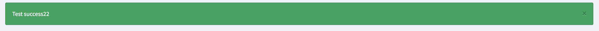
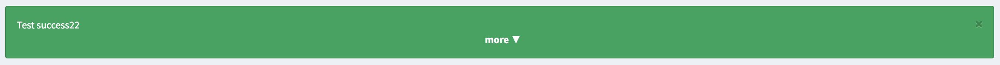
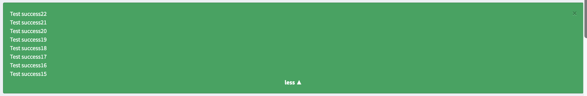

.. index::
    double: Flash Message; Definition

Flash Messages
==============

The admin bundle comes with a ``FlashManager`` to handle some *session flash messages types* that you can specify in the configuration
to be returned as a ``success``, ``warning`` or ``error`` type (or even all your custom types you want to add).
The classes are ``Sonata\AdminBundle\FlashMessage\`` and the layout already renders them on every
admin page, so there is nothing to install
(:doc:`/admin-bundle/getting_started/installation`).

Additionally, you can also add a ``css_class`` section for each flash messages that will be displayed on rendering.

.. note::

    The class names are adminata's, not Bootstrap's: ``success``, ``error``, ``warning`` and
    ``info``, which become ``adm-alert-success`` and friends. Dismissal is the ``sonata-dismiss``
    Stimulus controller — there is no ``data-dismiss`` data API, because there is no jQuery to
    read it. adminata's own ``@SonataAdmin/FlashMessage/render.html.twig`` maps Sonata's
    ``success``/``danger``/``warning``/``info`` onto those four for you.

An Example of type ``success``

When there are more than one flasmessage of a type (``success``, ``warning`` or ``error``),
the flashmessages automatically group.

Grouped flashmessage (collapsed)

Grouped flashmessage (expanded)

Configuration
-------------

.. code-block:: yaml

    # config/packages/sonata_twig.yaml

    sonata_twig:
        flashmessage:
            success:
                types:
                    - my_custom_bundle_success
                    - my_other_bundle_success

            warning:
                types:
                    - my_custom_bundle_warning

            error:
                css_class: error # optionally, a CSS class can be defined
                types:
                    - my_custom_bundle

            custom_type: # You can add custom types too
                types:
                    - custom_bundle_type

You can specify multiple *flash messages types* you want to manage here.

Usage
-----

To use this feature in your PHP classes/controllers, inject
``Sonata\AdminBundle\FlashMessage\FlashManagerInterface`` (the service id is
``sonata.twig.flashmessage.manager``)::

    use Sonata\AdminBundle\FlashMessage\FlashManagerInterface;

    public function __construct(private FlashManagerInterface $flashManager)
    {
    }

    // ...

    $messages = $this->flashManager->get('success');

To use this feature in your templates, include the following template:

.. code-block:: html+twig

    

You can also use your own template. Below, you can see an example:

.. code-block:: html+twig

    {# check each types #}
    

        {# get messages from current type #}
        

        {# display flash message; sonata_flashmessages_class returns the configured CSS class #}
        
            

                
{{ message|raw }}

                <button type="button"
                        class="adm-alert__dismiss"
                        aria-label="{{ 'message_close'|trans({}, 'SonataAdminBundle') }}"
                        {{ stimulus_action('sonata-dismiss', 'dismiss', 'click') }}>
                    <i class="fas fa-xmark" aria-hidden="true"></i>
                </button>
            

        

    
